## 引言：FauniSearch 从何而来？
之前做 RAG 的时候，我和很多人一样，有技术路径依赖：解析/OCR -> 分块 -> Embedding -> 索引 -> 召回 -> 重排 -> 生成回答。

但当我开始更多使用 Coding/Claw 类 Agent 产品时，我观察到一个有趣的现象：
- 对于文本/代码搜索，主流 Agent 产品基本都没有用重载的 RAG，而是回到了更简单直接的 `grep`（正则文本匹配工具）、FTS（全文搜索）
- 对于复杂文档、图片、视频的搜索，业界又明显投入不够，仍然缺少一个既适合个人，也适合 Agent 的 Unified 多模态检索工具

我转而开始思考其中的原由，FauniSearch 由此而生。

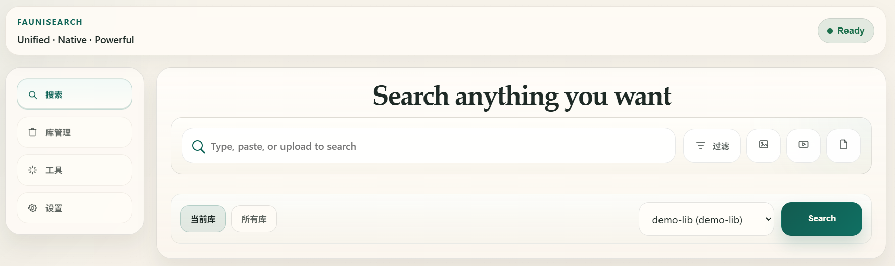

> 项目地址：https://github.com/wowfun/fauni-search  
> FauniSearch 为**纯 Vibe Coding 项目**，使用 Codex 配合 SDD + TDD 构建，当前还处于早期开发阶段。  
> FauniSearch 当前仍聚焦于功能完善，暂时无法做到开箱即用，安装体验需要一定的技术和硬件门槛。  
> **如无特殊说明，文中 RAG 默认指文本向量检索为主的 RAG 系统。**

## 1. 当前 RAG 的主要矛盾：文本检索 over-developed，多模态检索 under-developed

### 为什么主流 Agent 本地文本搜索不使用 RAG？

在**本地文本与代码搜索**里，Agent 通常会执行“搜一下—看一下—再搜一下”的高频闭环，RAG 在其中会显得有些“用力过猛”。

主流 Agent 通常先用 grep、ripgrep 或 FTS 做词法定位，必要时再补语义检索（甚至没有语义搜索）。原因很简单：本地搜索的第一目标通常不是“理解主题”，而是**以最低时延、最低成本、最高可验证性**找到原文位置，例如某句原话、函数名、错误串、路径等。

相较之下，RAG 多出的解析分块、增量索引、召回重排等环节不仅增加时延与索引维护成本，还会因为参差不齐的 Embedding 产生语义偏移的检索结果。换句话说，对于本地文本搜索，precision 往往比语义层面的 recall 更重要。搜索 `DATABASE_URL` 时，你不会想要一堆“数据库连接连接”文档。

更糟的是，RAG 的每个环节中都包含了许多需要调优的参数。每个参数的微调都可能引起性能的非线性变化，导致出现“哪一层都OK，但最终效果就是不好”的系统性问题，即所谓的“牵一发动全身”。

Agent 偏爱 grep/FTS，有一个很务实的原因：**容易 debug**。grep 的输出天然是“文件 + 行”。而 RAG 效果不好时，往往只能给出“chunk 切坏了”“embedding 不合适”“rerank 压错了”等问题猜测。

另一方面，Agent 在工作过程中会频繁修改文件内容，文件处于一种被不断创建、编辑和删除的动态工作流中。这种高频的状态流转，成功击中了 RAG 的软肋，**越复杂的 RAG 系统越难以适应这种高频变动的工作环境**。

### 超长上下文时代的颠覆与挑战

以文本向量检索为核心的 RAG 虽然在过去几年大放异彩，但其**本质是对早期 LLM 极为有限的上下文窗口以及严重偏科（仅文本处理强）的技术妥协**。通过将庞大的知识库切分为细粒度的信息块（Chunks），RAG 系统能够以极低的 Token 预算将相关的知识给到模型。

然而，随着 LLM 上下文窗口提升、推理成本降低、多模态能力增强，这一技术前提正在迅速瓦解。但这并不代表可以毫无顾忌地依赖模型的超长上下文，RAG 在许多场景下仍有其用武之地。

当前许多 Harness 工程的核心任务从“如何尽可能多地向模型塞入信息”转变为了“如何精准地剔除冗余信息”，用于避免上下文腐烂 (Context Rot)。但即便如此，能够随时根据明确指令提取特定文件片段或字符串的 `grep`，也比总是返回一堆冗长且附带大量周边无关文本的 RAG 更为得心应手。

### 棘手的复杂文档与多模态检索

前文说在本地文本/代码搜索里，问题是“RAG 做得太重”，到了复杂文档与多模态检索这里，又走向了另一种极端：**系统做得还远远不够**。

在PDF、PPT、扫描件、图片、视频这些解析容易出错的文件中，信息并不天然以文本形式存在，相反，混排的结构、混合的图表很多时候才是最重要的信息载体。

受限于 LLM 技术发展的速度和惯性，业界最常见的处理方式并不是“直接理解这些对象”，而是想办法先把它们降维成文本：PDF 走解析/OCR，图片走 OCR/描述生成，视频走 ASR/摘要等，然后再走一遍熟悉的文本 RAG 链路。这个思路在工程上当然可以落地，但它有一个很明显的问题：**检索系统真正处理的不是原生对象，只是它们的文本代理。**

一旦走到这一步，信息损失几乎不可避免。文档里的表格结构会被打散，页面布局会被抹平，图片中的空间关系会被压缩成一句模糊描述，视频更是只剩下一段转录文本。最后系统看起来“已经支持多模态”，但实际上只是把它重新包装成了文本检索问题。

简言之，针对文本的 RAG 存在明显 over-developed，而统一的多模态检索则方兴未艾。而这正是 FauniSearch 想要解决的问题。

## 2. FauniSearch：统一的原生多模态检索系统

FauniSearch 是一个统一的原生多模态检索系统。支持输入文本、图片、视频、文档等模态作为查询，搜索并定位相关的文档页、图片以及视频片段。

### 2.1 何谓“统一”和“原生”的多模态

许多 RAG 系统为实现对各类文档的支持，往往会为不同的数据形式定制不同的处理链路和补救措施，以增强系统能力，但整个系统也变得复杂且臃肿。我们知道，**决定一个系统整体效果的往往是其中最薄弱的那一环，即“木桶效应”。**因此，在吸取 RAG 领域这些“苦涩的教训”后，我在设计 FauniSearch 时，严格遵循两个设计原则：**统一 (Unified)**和**原生 (Native)**。

首先为了避免每种模态各自长出一套孤立的索引和检索管线，FauniSearch 把不同模态数据的索引和检索尽量收敛到同一套抽象语义上。由此引入了一个核心的概念设计：向量空间 (Vector Space)。**系统不再以内容类型为中心构建管线，而是以向量空间为中心。**而向量空间的构建方式则基于模型的原生能力。不同类型的原始内容先被规约为统一的视觉单元，根据所配置 Embedding 模型的原生能力，运行时适配器 (Runtime Adapter) 会将它们映射到一个或多个向量空间。不同类型的查询也沿着同一套语义生成一个或多个向量空间的查询表示，并执行同向量空间检索。

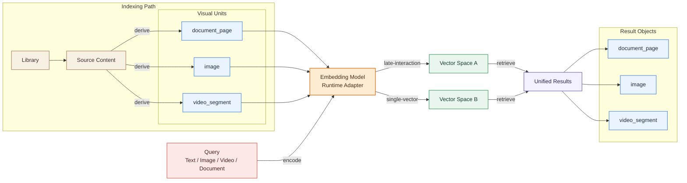

另一方面，FauniSearch 将常见模态（文本、图片、视频）提升为同等的“原生”对象，充分利用当前多模态模型的原生能力，并规避模态转换（例如常见的 Any-to-Text）带来的未必有益的系统复杂度和信息损失。

### 2.2 系统架构设计

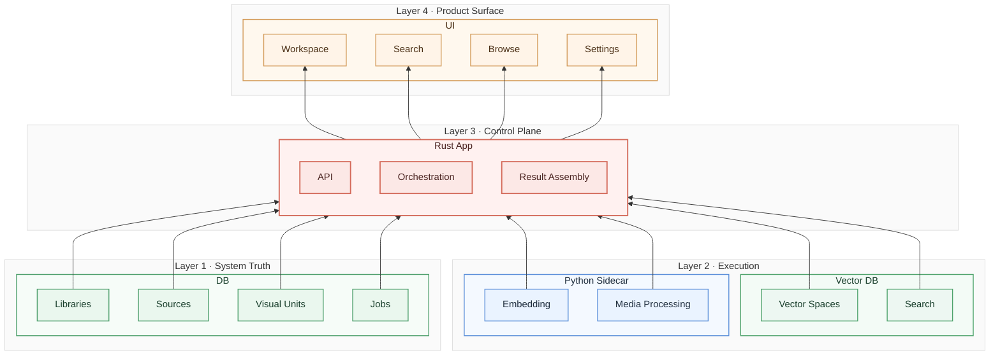

FauniSearch 主要有四部分：Rust 主服务、Python Sidecar、结构化与向量存储以及用户界面。

尽管我没学过 Rust，但业界大量使用 Rust 重构系统并取得性能和可靠性的双重显著提升的案例，还是让我决定从长远考虑 FauniSearch 的主服务应该使用 Rust 实现。

FauniSearch 需要一个能够长期稳定且高效运行、管理复杂状态和资源的系统中枢，而 Rust 的**内存安全、零成本抽象和强大的并发支持**这些特性，正好满足了这一需求。同时，Rust 的工具链（Cargo、rustfmt、Clippy、测试框架）也能帮助 FauniSearch 在持续迭代中保持代码质量和系统稳定。

更深的考量是，Rust 还有一个被低估的优点：它其实很适合 AI Coding。AI 写代码非常快，但写完之后怎么收敛、怎么验证、怎么防止一轮轮改动把系统写散、写崩，是要解决的关键问题。Rust 很像给 AI 代码生成配了一套硬约束脚手架：模型负责展开实现，编译器和工具链负责把明显不成立的东西挡回去，人再去做架构判断和最终取舍。

尽管 Rust 有诸多优点，但对于模型推理、媒体处理而言，仍远不及 Python 生态成熟。因此，FauniSearch 把这些能力统一交给了 Python Sidecar 来实现。

### 2.3 Web UI 设计
相比于功能实现，我觉得如何指导 AI 产出一个审美达标的 UI 设计更具有挑战性。审美具有一定的主观性，但好的设计是客观存在的。就 UI/UX 设计而言，当前的 AI 远不能做到我和人类设计师那样高效地沟通对齐。你需要不断地截图、打字指出它设计的不足之处，同时，好的设计又往往体现在细节上，AI 直接给出的设计在细节上往往不忍直视。

先放一张最初的 Web UI，当时的重心主要放在后端功能实现上，没对 AI 提任何设计要求，只要求能进行功能测试。
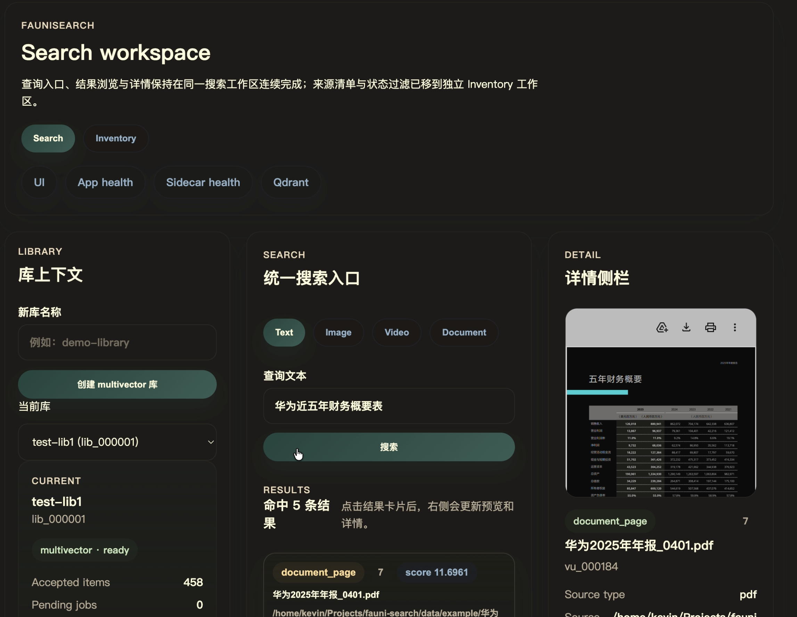

下面是我花费了很多精力，用了多个设计工具和提示词技巧反复迭代出的让我还算满意的原型设计（不代表最终实现效果图）。

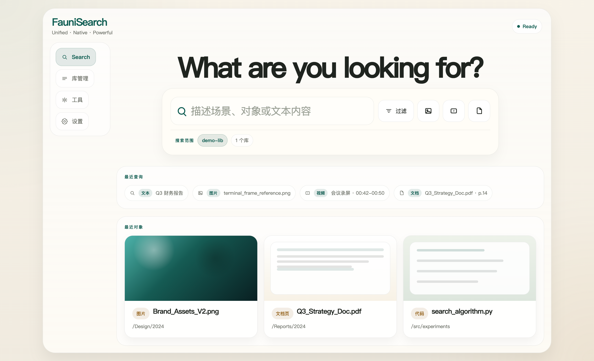

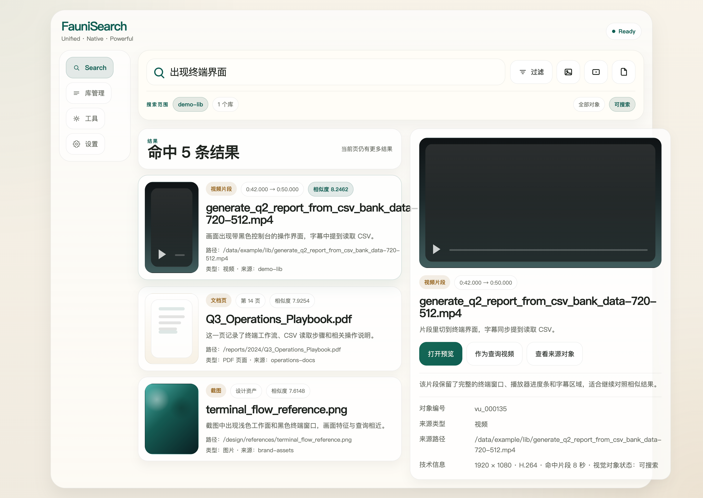

## 3. 功能演示
### 3.1 Text as Query
#### 文搜文档内容
案例 t2d-1：搜华为近五年财务概要表

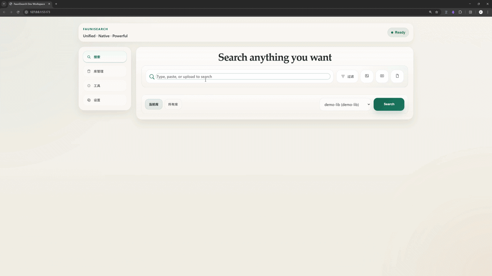

案例 t2d-2：搜小米2025年中期报告总结性信息图
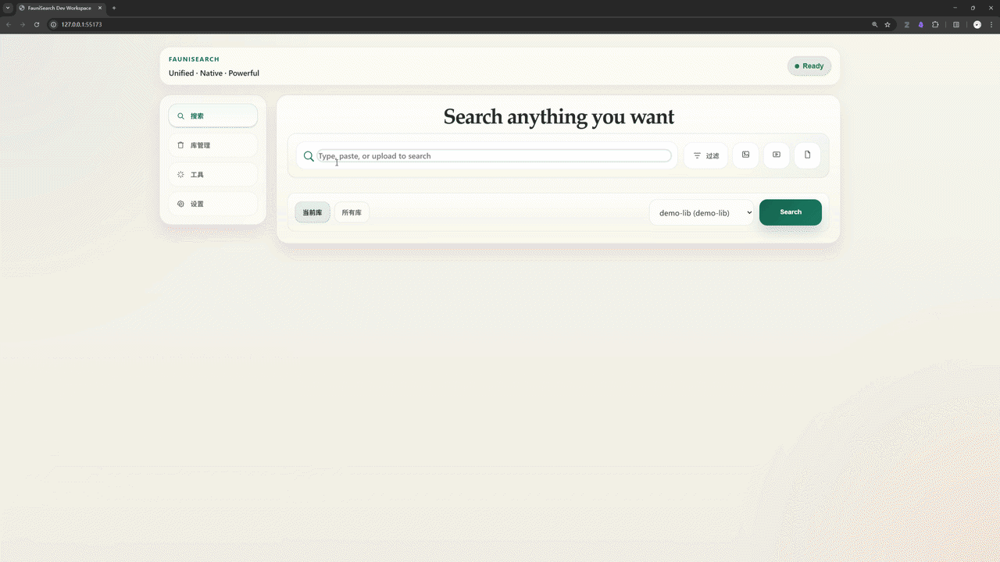

案例 t2d-3：搜太阳能光伏板图片
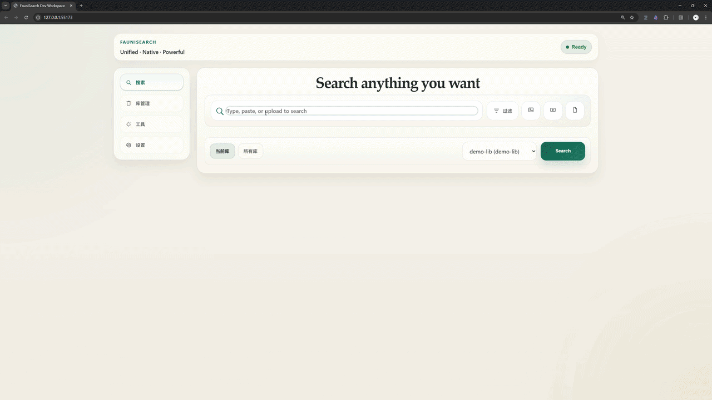

#### 文搜图片内容
案例 t2i-1：搜与问题相关的内容：What is the percentage change in current assets from 2018 to 2019?
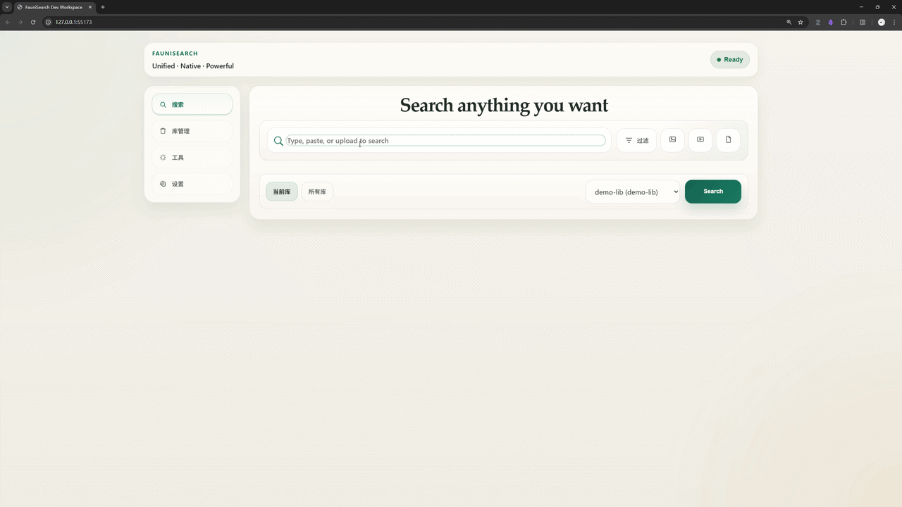

#### 文搜视频片段
案例 t2v-1：搜出现终端界面的片段
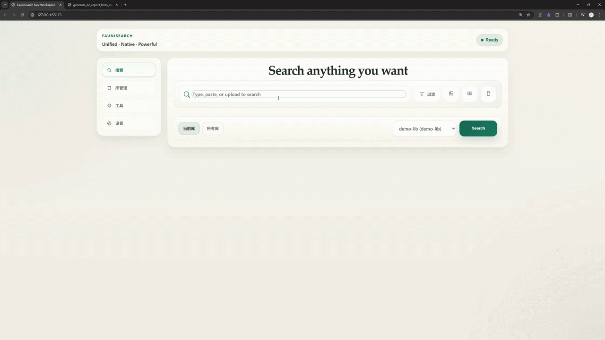

### 3.2 Image as Query
#### 图搜文档内容
案例 i2d-1：搜包含相同或相关图片的文档页
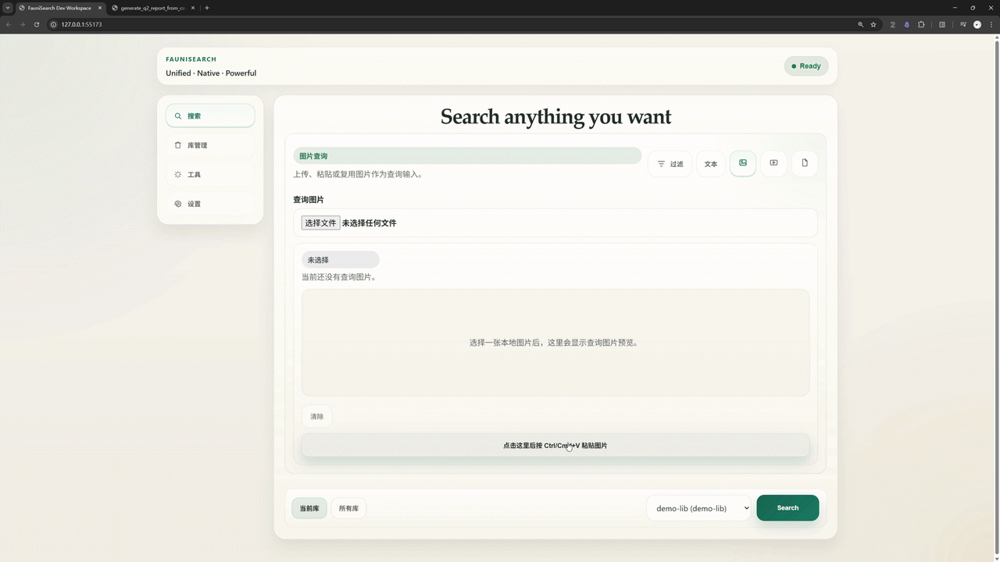

案例 i2d-2：搜包含机器人图像的文档页
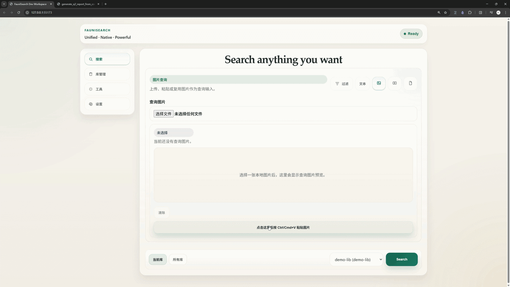

#### 图搜视频片段
案例 i2v-1：搜包含相同或相关图片的视频片段
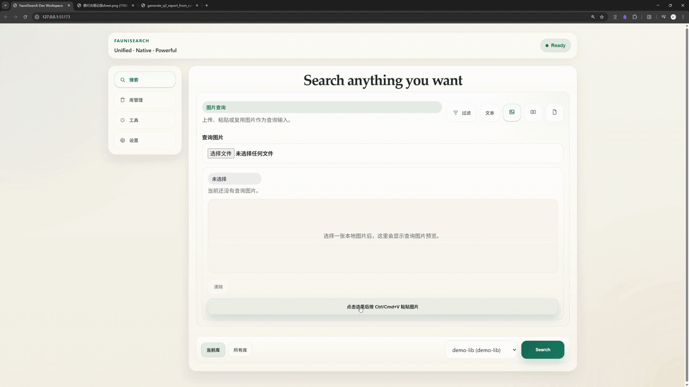

## 小结

FauniSearch 是一个探索性项目，还有很多功能、体验和性能的挑战需要去克服。敬请期待 FauniSearch 的后续更新，也欢迎一起打造新一代多模态检索系统！