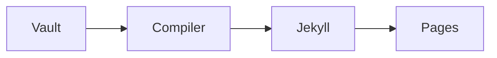

# 语法

`ofm@1` 语法配置具有带版本的固定契约。使用这些语法后，源文件在 Obsidian、生成站点和纯文本编辑器中都能保持可读。

## 链接与嵌入

链接到其他笔记时，可以使用 Wiki 链接，并通过别名设置显示文本：[[docs/development/architecture|编译器架构]]。标题片段可以链接到 [[docs/development/architecture#Compiler boundary|编译器边界]]，块片段可以链接到 [[docs/development/architecture#^compiler-contract|编译器契约]]。

下面的摘录嵌入自架构笔记：

![[docs/development/architecture#^compiler-contract]]

嵌入内容会保留来源标记。同一段摘录多次出现时，编译器会限定各实例的 DOM ID，确保锚点不会重复。

## 文本标记与任务

普通 Markdown 可以与 ==高亮==、脚注和不同任务状态一起使用。[^contract]

- [x] 至少发布一篇笔记。
- [ ] 替换示例标题。
- [/] 审阅草稿。

[^contract]: 完整兼容性表格位于 [[docs/development/ofm-conformance|OFM v1 Conformance]]。

## 提示块

> [!tip] 源文件仍然易读
> 不识别 Obsidian 语法的编辑器仍会把提示块显示为普通引用块。

> [!question]- 折叠笔记
> 折叠提示块使用原生 details 元素，因此键盘用户仍能操作。

> [!field-observation] 自定义类型
> 未知提示块标识会使用中性样式。

> [!note] 嵌套内容
> 外层提示块可以包含普通文本。
> > [!tip] 内层观察
> > 内层提示块会保留自己的标题和类型。

## 数学公式与图表

行内公式 $e^{i\pi}+1=0$ 会保持源文本可见，直到 MathJax 载入。

$$
\operatorname{score}(q, d)=\sum_{t\in q}\operatorname{weight}(t, d)
$$



只有实际使用 Mermaid 或 MathJax 的页面才会载入对应资源。

## 媒体

图片嵌入可以指定宽度，也可以同时指定宽度和高度：

![[assets/research-folio.svg|640]]

```md
![[diagram.png|640x360]]
![[paper.pdf#page=3]]
![[paper.pdf#height=560]]
```

本地音频、视频和 PDF 使用浏览器原生控件。在 v1 中，`.3gp` 统一视为音频，`.webm` 统一视为视频。PDF 嵌入支持页码和高度选项。Canvas 与 Bases 文件会显示为下载卡片，因为 v1 不执行其中的数据模型。

外部 HTTPS 媒体继续使用普通 Markdown 图片语法。GIF 与其他受支持图片会保留图片语义，也支持可选的 Obsidian 尺寸。直接视频文件使用原生控件。YouTube、Bilibili 和 Vimeo 链接会变成重视隐私的延迟载入播放器；X 或 Twitter 状态链接会变成延迟载入的 Tweet 嵌入，并保留普通链接作为降级入口。

```md


```

只有无法通过上述媒体形式表达的页面才应使用显式 iframe：

```html
<iframe
  src="https://example.com/interactive"
  title="Interactive example"
  height="560">
</iframe>
```

编译器只接受不含凭据和自定义端口的 HTTPS iframe URL。它会丢弃作者写入的主动内容属性，通过标准服务 URL 重建已知视频播放器，并为普通页面应用固定 sandbox。外部嵌入只会在实际包含它的页面上载入，并获得范围受限的内容安全策略。普通 frame 和 Tweet 都保留普通 HTTPS 降级链接。构建不会连接服务提供商。内联代码、代码块或注释中的 iframe 会继续作为惰性源文本。

## 标签与注释

正文标签（例如 #field-notes）和嵌套标签（例如 #guide/syntax）会与 frontmatter 中的标签合并。站点通过一个带有稳定锚点的标签索引展示它们。

Obsidian 注释与 HTML 注释不会进入 HTML、预览、Search、Graph 元数据或订阅源。

每篇公开笔记都具有 Copy page 和 View as Markdown 操作。两者使用同一份不含 frontmatter 的 Markdown 资源，并保留原始正文，其中包括 OFM 语法和注释。公开笔记中的注释仍属于公开源文本。

%% 这句话只在源文件中可见。 %%

混合文字示例请参阅 [[中文示例|CJK 展示页]]。
