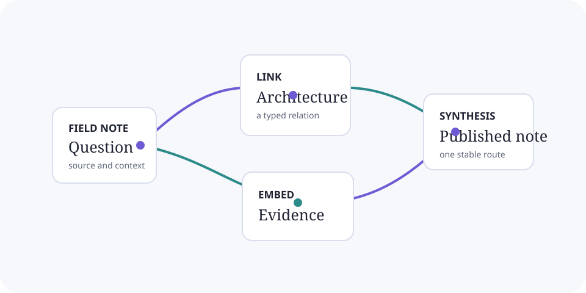

# One Markdown folder, two ways to publish

**A complete blog or documentation site from a Markdown folder. Just push to GitHub. GitHub Actions builds and publishes it, with nothing to install or run locally.**

This working starter is also the manual for `jekyll-obsidian`. Write ordinary Markdown in any editor, including Obsidian. Minimal turns the same folder into a personal site or blog, while Docs turns it into a focused handbook. Push your changes to GitHub and the included workflow builds the selected theme and publishes it to Pages. You never need to run a local build command or maintain a paid server.

> [!note] Open the source in Obsidian
> The compiler reads `website/docs/`, but never rewrites the source. Open this directory directly and keep using links, properties, callouts, and embeds in Obsidian.

## Begin here

- [[Integration|Host Integration]] covers copying `website/` into another repository.
- [[Getting Started]] covers GitHub Actions publishing, the publication boundary, and optional local preview.
- [[Syntax]] lists the Obsidian-flavored Markdown supported in v1.
- [[Customization]] explains type, color, navigation, and repository links.
- [[Portfolio]] explains automatic project collections and imported GitHub Markdown bodies.
- [[Comments]] explains GitHub Discussions setup and comment-thread behavior.
- [[Analytics]] explains optional Cloudflare and Google traffic measurement.
- [[Localization]] explains locale manifests, translation overlays, fallback pages, and SEO behavior.
- [[Deployment]] follows the GitHub Pages workflow from pull request to release.
- [[docs/development/index|Developer Guide]] covers contributor setup, architecture, and the OFM contract.
- [[中文示例|CJK showcase]] demonstrates Chinese, Japanese, and mixed-script search.

## Feature map

- Start with [[Integration|Host Integration]], [[Getting Started]], and [[Deployment]] for the no-local-build GitHub Actions path, optional preview, root or project `baseurl`, and custom domains.
- Use [[Customization]] for Minimal and Docs, pages, posts, documentation, Blog, navigation, contacts, tags, Atom feeds, and generated system routes. [[Portfolio]] owns project collections, external GitHub bodies, and the View imported Markdown action.
- Read [[Syntax]] and [[Customization]] for OFM, media, Search, previews, outlines, relations, local and complete Graph views, Copy page, View as Markdown, and source actions.
- Add locale overlays, Giscus, or optional traffic measurement through [[Localization]], [[Comments]], and [[Analytics]]. The compiler also emits canonical metadata, a sitemap, a 404 page, and locale-partitioned search and graph resources.

## A useful constraint

The repository is public source material. The publication policy controls generated site output, not access to committed files. Keep truly private notes in another folder or an uncommitted location.

Minimal is the default build and deployment theme. Docs is the standalone handbook. Both use the same authored content routes without bringing Docs navigation into the general-purpose experience.
